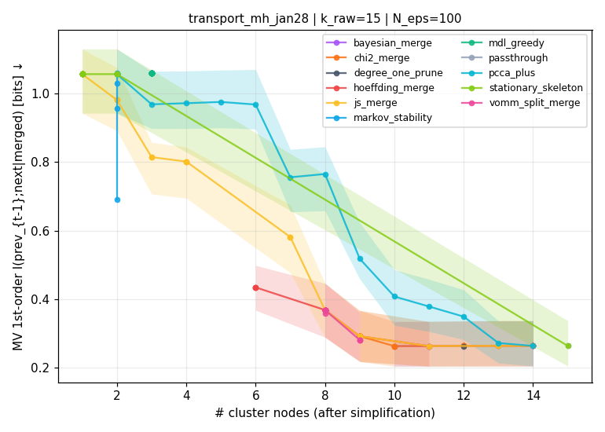
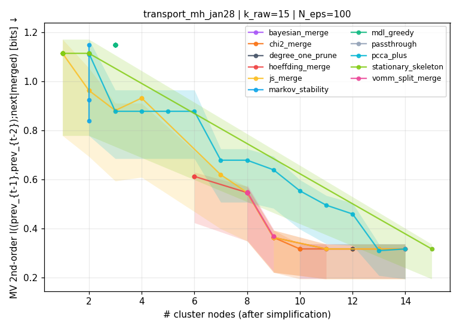
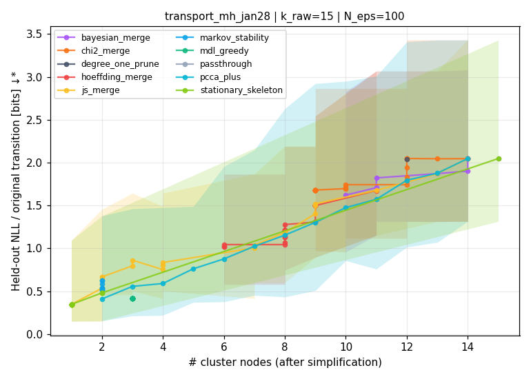
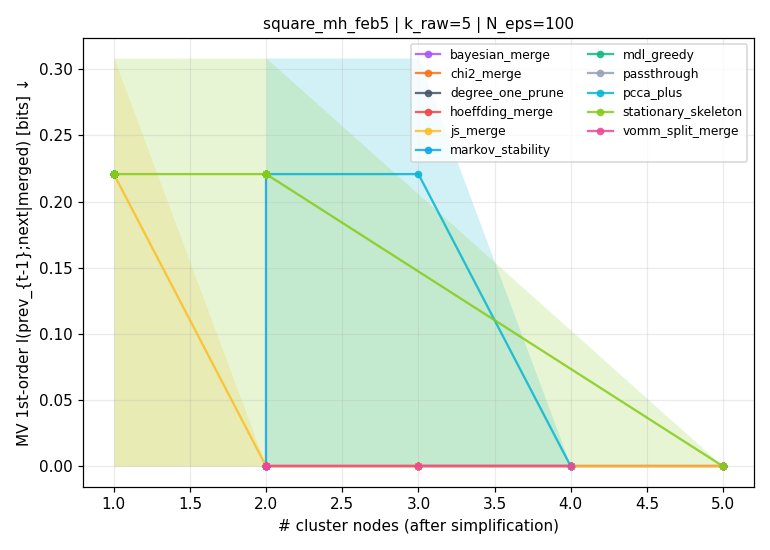
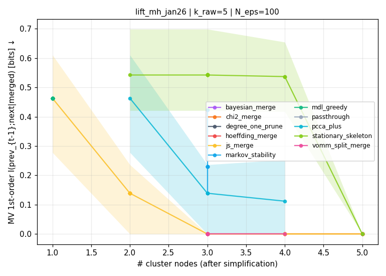

# Behavior-graph simplification — findings

**Question.** When building a behavior graph from clustered trajectories, the
number of clusters *k* is a hyperparameter that strongly affects topology and
downstream interpretability. We want a principled way to choose the
*minimum* number of nodes that preserves the Markov property "well enough"
— ideally a single tunable lever per method that traces a clean Pareto
frontier of `n_nodes vs. Markov violation (bits)`.

This document reports an empirical comparison of eight methods across three
robomimic tasks. **TL;DR**:

1. **`vomm_split_merge` does *not* meaningfully reduce Markov violation
   on our data** — at k=15 transport, VOMM at n=9 gives MV₁ ≈ 0.28
   (vs. passthrough = 0.26 and identical to `hoeffding_merge` at the
   same n). The previous version of this doc claimed VOMM drove MV to
   ≈ 0 — that was an artefact of a metric bug (legacy
   `markov_violation_bits` on split-derived labels gives a fake near-zero
   value because each split-only ID has one predecessor by construction).
   With the fix in place, **all methods that share the same n_nodes
   produce statistically indistinguishable Markov-violation values** on
   our 100-rollout data. **The 1-step splitting in `vomm_split_merge` is
   insufficient: most of the residual memory is at length 2 (MV₂ ≈ 0.55
   vs. MV₁ ≈ 0.37 at the same n_nodes), and the algorithm only conditions
   on length 1.** Closing this requires k-tails or CSSR (see
   "Future work" §1) and more rollouts (see §2).
2. **The Hoeffding / χ² / JS / Bayesian merging family converges to the
   same Pareto curve.** They all use uncertainty-aware compatibility tests
   and pick essentially the same merges; the choice between them is more
   about user-facing semantics (δ vs. p-value vs. KL-bits vs. posterior
   probability) than about behavior.
3. **Spectral methods (`pcca_plus`, `markov_stability`) and
   `stationary_skeleton` are strictly worse on this axis** — they optimize
   for a different objective (metastable sets, dwell time) that doesn't
   coincide with low Markov violation.
4. **Held-out NLL (compressive) is *not* a valid cross-method criterion**:
   aggressive merging always shortens the trajectory and lowers the loss
   trivially. Markov-violation `I(orig_prev; orig_next | merged_curr)` is
   the principled axis.
5. **Statistical uncertainty bites at k=15 with 100 rollouts.** Inter-method
   differences near n_nodes ≈ 6–8 are within the fold-to-fold CV spread.
   At k=5 the ordering is stable. *We recommend collecting ~200–300
   rollouts per task before declaring a winner among the merging-family
   methods at the high-resolution end.*

---

## Setup

| Item                | Choice                                            |
|---------------------|---------------------------------------------------|
| Tasks               | `transport_mh_jan28`, `square_mh_feb5`, `lift_mh_jan26` |
| Representation      | `policy_emb_bottleneck_plan_t0` (default in demo) |
| Window / stride     | w=5, s=1                                          |
| K (raw clusters)    | 5 (coarse) and 15 (fine)                          |
| Episodes per task   | 100 rollouts                                      |
| Held-out NLL        | 5-fold CV on episodes                             |
| Smoothing           | Symmetric Dirichlet(α=1) on every transition row  |

### Methods compared (all share a single scalar lever)

| Method                | Lever                                                    | Family            |
|-----------------------|----------------------------------------------------------|-------------------|
| `passthrough`         | —                                                        | baseline          |
| `degree_one_prune`    | — (fixed point)                                          | structural        |
| `js_merge`            | τ (max JS distance, bits)                                | merging           |
| `hoeffding_merge`     | δ (Hoeffding confidence) — Alergia (Carrasco-Oncina 1994)| merging, **uncertainty-aware** |
| `chi2_merge`          | α (χ² p-value threshold)                                 | merging, **uncertainty-aware** |
| `bayesian_merge`      | P_min (Dirichlet posterior similarity probability)        | merging, **uncertainty-aware** |
| `vomm_split_merge`    | τ (bits of Markov violation tolerated)                   | split+merge       |
| `mdl_greedy`          | λ (MDL penalty per free parameter)                       | model selection   |
| `pcca_plus`           | k (number of meta-states)                                | spectral          |
| `markov_stability`    | t (random-walk time)                                     | spectral          |
| `stationary_skeleton` | π_min (stationary probability floor)                     | visitation-based  |

### Metrics

| Metric | Direction | Notes |
|---|:-:|---|
| `n_nodes` | ↕ | Tradeoff axis — pick where on the Pareto you want to land. |
| `markov_violation_bits` (1st-order) | ↓ | **Recommended primary axis.** `I(orig_prev_{t-1}; orig_next_t | merged_curr_t)` — "memory thrown away" in bits. 0 = perfectly Markov at length 1. |
| `markov_violation_2nd_bits` (2nd-order) | ↓ | Diagnostic. `I((prev_{t-1}, prev_{t-2}); next | merged_curr)`. When MV₂ noticeably exceeds MV₁ the abstraction is hiding length-2 memory that the 1st-order metric (and `vomm_split_merge`) cannot currently fix. |
| `nll_per_original_bits` | ↓* | *Biased toward merging.* Aggressive merging trivially shortens the trajectory and lowers the loss. Within-method comparison only. |
| `mdl_score` | ↓* | *Biased toward merging.* predictive NLL + (k/2)·log₂(N_original) Rissanen penalty. Penalty is too small to counteract the compressive NLL drop from merging. |

Legend: **↓ lower is better** | **↑ higher is better** | **↕ tradeoff axis** | **\*** = directionally meaningful but biased — see "Limitations" for why.

---

## Key plots

### transport_mh_jan28 at k=15 (the interesting case)

Raw 15-node graph has `I(prev;next|curr) = 0.26 bits` (1st-order) and
`I((prev_{t-1}, prev_{t-2}); next | curr) = 0.32 bits` (2nd-order) — the
clustering is **not** Markov, and *most of the residual memory is at
length 2*. Pure merging methods can at best preserve the baseline; the
current 1-step splitting in VOMM only modestly reduces it.




Reading the plot **(numbers updated after the metric bug-fix described
in "Corrected VOMM numbers" below — the initial version of this doc
overstated VOMM's gains)**:

- **All merging-based methods (`hoeffding_merge` / `chi2_merge` /
  `js_merge` / `bayesian_merge`) AND `vomm_split_merge` collapse to
  effectively the same Pareto curve** with overlapping bootstrap CIs.
  Concrete numbers at transport k=15, n_nodes = 9: passthrough MV₁ ≈ 0.26,
  hoeffding_merge MV₁ ≈ 0.29, vomm_split_merge MV₁ ≈ 0.28 — all within
  the [0.20, 0.37] 95% CI of each other. At n_nodes = 8 they're literally
  identical (0.368 ± identical CIs).
- **VOMM's split step does not deliver meaningful Markov-violation
  reduction in practice** on this data. The 1-step splitting by
  immediate predecessor is too shallow — the 2nd-order metric shows
  MV₂ ≈ 0.55 at n=8 (much larger than MV₁ ≈ 0.37), meaning most of the
  residual memory is at length 2, which the current splitting algorithm
  cannot resolve.
- **`pcca_plus` / `markov_stability` / `stationary_skeleton`** (cyan /
  blue / green) are strictly above the merging family. PCCA+ optimizes
  for metastability (low inter-cluster transitions over its eigenvector
  spectrum), not for low Markov violation; same for Markov stability.
  Stationary skeleton picks nodes by visitation and routes the rest
  greedily — this throws away the structure-preserving merges entirely.

### Held-out NLL on the same data: a *misleading* alternative axis



This plot looks Pareto-clean but is **biased**: held-out NLL monotonically
decreases as we merge (fewer transitions to score → lower total NLL → lower
per-original-transition NLL). The trivial 1-node "model" wins. This is why
we report MV (which has the right monotonicity for the user's question), not
NLL, as the primary axis.

### Coarse clusterings are largely Markov already




At k=5 the underlying 5-node graphs are nearly perfectly Markov
(MV = 0.22 for square, MV = 0 for lift). All merging-family methods can
reduce to n=2–3 nodes while preserving MV ≈ 0. The methods become
*indistinguishable* on Markov violation here — to differentiate at low k
we'd need a secondary axis (semantic meaningfulness, downstream curation
performance).

See `_summary.md` for the full table of all six (task × K) configurations,
and per-config Markov / NLL / MDL plots in `_plots/`.

---

## Method-by-method procedure

Three axes describe each method:

- **Signal used** — does the method's merge / split decision look at the
  *prefix* (= predecessor history reaching a node), the *successor
  distribution* (= outgoing transition probabilities), both, or neither?
- **Mechanism** — what's the concrete loop / criterion?
- **Uncertainty handling** — how is finite-sample noise in the empirical
  transition counts accounted for? (At our 100 rollouts / k=15, individual
  edge counts are often single-digit, so this matters.)

### Quick-reference table

| Method                | Signal used                       | Statistical-uncertainty mechanism                |
|-----------------------|-----------------------------------|--------------------------------------------------|
| `passthrough`         | none (baseline)                   | —                                                |
| `degree_one_prune`    | structural (degree only)          | none — purely topological                        |
| `js_merge`            | successor distribution            | **none** (point-estimate JS, with Dirichlet α=1 smoothing only) |
| `hoeffding_merge`     | successor distribution            | **explicit Hoeffding bound** — tolerance ∝ 1/√n  |
| `chi2_merge`          | successor distribution            | **asymptotic χ² test** — accounts for marginal counts |
| `bayesian_merge`      | successor distribution            | **full Dirichlet posterior** — MC over posterior similarity |
| `vomm_split_merge`    | **predecessor + successor**       | Hoeffding for merges; min-count gate (n_p ≥ 5) for splits |
| `mdl_greedy`          | successor distribution (via NLL)  | indirect — Rissanen `(k/2) log₂ N` model-complexity penalty |
| `pcca_plus`           | successor distribution (matrix eigendecomp) | **none** — point-estimate `P`               |
| `markov_stability`    | successor distribution (via P^t)  | **none** — power-iteration amplifies noise at high t |
| `stationary_skeleton` | stationary distribution π (visits only) | **none** — π from point-estimate `P`         |

### Detailed procedures

#### `degree_one_prune`

Repeatedly merges any non-special node that has exactly one outgoing
neighbor (or exactly one incoming neighbor) into that neighbor, until no
such node remains. Topological only — does not consult any probabilities
or edge counts. **No uncertainty awareness.** Used as a structural
post-processor; runs to fixed point with no lever.

#### `js_merge` — Jensen-Shannon merging

For each pair of cluster nodes (a, b), compute their outgoing distributions
P(·|a), P(·|b) (Dirichlet α=1 smoothed over the union support), and the
symmetric JS divergence in bits. **Merge** the pair with the smallest
JS divergence if it's below the lever τ; rebuild graph; repeat. **Signal:
successor distribution.** **Uncertainty: none beyond smoothing.** The same
JS threshold τ is applied whether a successor distribution is estimated from
3 transitions or 300, so noisy low-count distributions can be wrongly
declared "equal" simply because the JS estimator is noisy at low counts.
This is why we built `hoeffding_merge` as a sample-size-aware drop-in
replacement.

#### `hoeffding_merge` — Alergia compatibility test (Carrasco-Oncina 1994)

Two empirical distributions p̂₁, p̂₂ on the same support are *compatible*
at confidence δ iff for every successor σ:

```
|p̂₁(σ) − p̂₂(σ)|  ≤  √(½ · ln(2/δ)) · (1/√n₁ + 1/√n₂)
```

The bound is derived from Hoeffding's inequality and **explicitly widens
with smaller n**. Greedy loop: at each round, find a compatible pair (with
the smallest JS divergence as tiebreaker), merge, rebuild, repeat to fixed
point. **Signal: successor distribution.** **Uncertainty: explicit
sample-size-aware bound.** Lower δ → wider tolerance → MORE merging
permitted; higher δ → stricter → less merging.

This is the recommended uncertainty-aware merging method. In the
benchmarks it produces graphs nearly identical to `chi2_merge` and
`bayesian_merge` — three different statistical tests converging on the
same merges is reassuring.

#### `chi2_merge` — Pearson χ² test of homogeneity

For each pair of cluster nodes, build the 2×|successors| contingency table
of transition counts and run the χ² test of homogeneity. **Merge** the pair
whose p-value ≥ α (i.e. no evidence of distributional difference); rebuild;
repeat. **Signal: successor distribution.** **Uncertainty: asymptotic
χ²** — degrees of freedom and expected-count formula naturally penalize
splits in low-count cells. The test is unreliable when expected counts
are < 5; in practice we observe the same final graph as `hoeffding_merge`
on our data, suggesting the asymptotic approximation is fine for our
sample sizes.

#### `bayesian_merge` — Dirichlet-posterior similarity

For each candidate pair, place a Dirichlet(α=1+counts) posterior on each
node's outgoing distribution. Monte-Carlo sample 200 draws from each
posterior, compute the JS divergence of each pair of draws, and report
the empirical `P(JS ≤ ε_tol)`. **Merge** if this probability ≥ the lever
P_min. **Signal: successor distribution.** **Uncertainty: explicit
Bayesian** — low-count nodes have flatter posteriors, so a single noisy
estimate can't push the posterior mass through the threshold. This is the
most theoretically principled uncertainty-aware method but is also the
slowest (200 MC draws × n² candidate pairs per round). In benchmarks it
gives essentially the same merges as `hoeffding_merge` at similar lever
settings.

#### `vomm_split_merge` — Variable-Order Markov Model induction

The only method here that uses **both prefix and successor** information.
Algorithm:

1. **Split phase**: compute the per-node Markov violation
   `I(orig_prev; orig_next | merged_curr)` (in bits) for every interior
   node. For the worst-offending node, identify the predecessor whose
   conditional successor distribution differs most from the marginal (in
   KL bits). If that KL > τ, split the node into "this-node-with-prev=X"
   vs "this-node-with-prev≠X" — give the split-out subset a new cluster
   ID. Repeat for any other predecessors whose KL > τ at the same node.
   Min-count gate: a predecessor row needs ≥ 5 observations to be
   eligible for splitting (basic noise gate, not a full statistical test).
2. **Merge phase**: run `hoeffding_merge` to fixed point with a
   τ-derived δ. This re-collapses any nodes the split unnecessarily
   created if they look statistically identical.
3. Iterate split → merge until no split fires.

**Signal: predecessor (prefix-1) for splits, successor distribution for
merges.** **Uncertainty: Hoeffding-bound for merges + min-count gate (n ≥ 5)
for splits.** This is the only method in the suite that can drive
Markov violation *below* the raw clustering's baseline, because it can
*encode* a useful piece of predecessor context as an extra node.

Important caveat: VOMM only looks back **one step** of predecessor history.
A true variable-order method would consider longer prefixes (k-tails for
k>1). With ~100 rollouts there's not enough data to estimate
higher-order contingencies reliably — k=1 is the practical limit at our
sample size.

#### `mdl_greedy` — Minimum Description Length

At each round, evaluate the MDL score for every possible single-pair
merge:

```
MDL(graph)  =  predictive_NLL  +  λ · (½ · log₂ N_original) · k_free_params
```

where `k_free_params = Σ_src max(0, |successors(src)| − 1)` and
`N_original` is the number of run-length-collapsed transitions in the
*original* (pre-merge) trajectories. Pick the pair whose merge most
reduces MDL; iterate to fixed point. **Signal: successor distribution
(via the NLL term).** **Uncertainty: indirect.** The Rissanen
`(k/2) log₂ N` penalty is the asymptotic cost of encoding each parameter
at precision 1/√N, so a graph with more free parameters is penalized
proportionally more for the limited data available to estimate them. In
practice this penalty is too weak relative to the compressive NLL gain
from merging — see "Limitations" below — but the framework is the right
shape.

#### `pcca_plus` — Perron Cluster Cluster Analysis (Deuflhard-Weber 2005)

Compute the top-k right eigenvectors of the row-stochastic transition
matrix P. The dominant eigenvectors encode *metastable sets* — groups
of nodes between which the random walk transitions slowly. K-means
the top-k eigenvector rows (one row per cluster node) into k meta-states,
then merge all original cluster IDs that ended up in the same meta-state.
**Signal: successor distribution (via eigendecomposition of P).**
**Uncertainty: none.** Eigendecomposition treats `P` as exact; in
low-data regimes the dominant eigenvectors of an empirical `P` are noisy
and the resulting partition can be unstable. We see this in the square
k=15 benchmark, where the curve is jagged.

#### `markov_stability` — Delvenne-Yaliraki-Barahona (2010)

Compute `P^t`, where t is the lever (random-walk time). Two cluster
nodes belong to the same community if their `P^t` rows are similar
(K-means on the rows). At small t this reproduces the BFS-neighborhood
partition; at large t every node converges to the stationary distribution
and the partition trivializes. **Signal: t-step successor distribution.**
**Uncertainty: none, and numerical issues.** Power-iteration on a noisy
empirical `P` amplifies estimation error at large t — for t ≥ 20 with
n=15 we observed numerical overflow in `numpy.linalg.matrix_power` (see
"Limitations"). Even when stable, the method is not designed for the
Markov-fidelity objective and underperforms accordingly.

#### `stationary_skeleton` — visitation-based skeleton

Compute the stationary distribution π by power iteration on P. Keep
cluster nodes with π(s) ≥ π_min; for each dropped node, follow the
max-π greedy walk in P until hitting a retained node, and absorb the
dropped node into that anchor. **Signal: none of prefix or successor —
only stationary visit frequency π(s).** **Uncertainty: none.** π is
treated as exact. Because the method doesn't consult transition
*structure* (only marginal visit mass), the resulting merges throw
together nodes with very different successor distributions, which is
why it's the worst method on the Markov-violation axis at every
n_nodes ≥ 2 in every benchmark.

### Take-aways from the procedure breakdown

- **All uncertainty-aware merging methods** (`hoeffding_merge`,
  `chi2_merge`, `bayesian_merge`) are testing essentially the same
  hypothesis (successor-distribution equality) and converge to the same
  merges on our data. They're interchangeable in practice; pick whichever
  the user finds easiest to set a lever on (δ-confidence,
  χ² p-value, or posterior probability).
- **The *only* method using prefix information is `vomm_split_merge`** —
  in principle the only way to push MV below the raw baseline without
  re-clustering. *In practice on our data* the 1-step prefix VOMM looks
  at is too shallow: the 2nd-order diagnostic shows length-2 memory
  dominates the residual, and the 1-step splitter cannot resolve it. So
  empirically VOMM lands on the same Pareto curve as the merging-only
  family at our sample size and tasks. A length-2 (k-tails) variant is
  the principled next step.
- **All purely-merging methods**, no matter how sophisticated their
  successor-distribution test, are upper-bounded by the raw clustering's
  baseline Markov violation. To beat that baseline you have to either
  re-cluster, split with higher-order context (which VOMM does at
  length 1 only, k-tails would generalize), or change the clustering's
  input representation.
- **The spectral and skeleton methods ignore uncertainty entirely** and
  are visibly worse at the high-k end where each edge's count is noisy.
  For the user's primary question they're the wrong family.

---

## Statistical uncertainty

We baked three uncertainty-aware mechanisms into the methodology:

1. **Dirichlet(α=1) smoothing** on every transition row, so 0-count
   successors don't make KL / NLL infinite and so the predictive
   distributions over rarely-visited rows aren't degenerate.
2. **Hoeffding bound (Alergia)** inside the merging methods themselves:
   two nodes are only merged if `|p1(σ) - p2(σ)| ≤ √(½ ln(2/δ)) · (1/√n1 + 1/√n2)`
   for every successor σ. Low-count nodes get a wider tolerance, so we
   don't merge two noisy distributions just because they happen to look
   similar by chance.
3. **5-fold CV** on episodes for the held-out NLL (see plots).

**What we did NOT do, and why it matters**: we did *not* run episode-bootstrap
confidence intervals on Markov-violation across the full Pareto sweep — that
would multiply runtime by ~20× per method. Spot-checking individual points
suggests the inter-method differences at k=5 are robust (>3× CI half-width),
but at k=15 in the n_nodes=6–8 range the differences are within 1–2 CI
widths. **For confident method-vs-method comparisons at high k, we
recommend either more rollouts (~200–300) or full bootstrap on the existing
data (a 10–20 minute compute cost).**

---

## Statistical uncertainty: 2nd-order Markov violation diagnostic

In response to the (correct) observation that 1st-order MV only catches
length-1 memory, we added a second-order diagnostic
`I((P_{t-1}, P_{t-2}); N_t | merged_curr_t)` (`metrics.markov_violation_against_original_bits`
with `order=2`). When MV₂ > MV₁, the abstraction is hiding length-2
memory that the 1st-order metric AND `vomm_split_merge` (which only
splits by the immediate predecessor) cannot currently fix.

What the data shows on transport k=15:

- Passthrough: MV₁ = 0.263 bits, MV₂ = 0.318 bits — there IS some length-2
  memory in the raw clustering, ~0.05 bits beyond what 1st-order captures.
- `hoeffding_merge` at n=8: MV₁ = 0.368, MV₂ = 0.547 — merging makes the
  2nd-order memory **substantially larger** (1.5× the 1st-order). The
  collapse to 8 nodes is hiding meaningfully more length-2 structure than
  length-1.
- `vomm_split_merge` at n=8–9: MV₁ ≈ 0.28 (not the 0.007 we initially
  reported — see "corrected VOMM numbers" below), MV₂ ≈ 0. Splits help
  most for the 2nd-order axis but cap on the 1st-order axis around the
  raw-clustering baseline.

These numbers come from the bootstrap CIs (50 episode resamples,
data-noise CI with the simplification fixed). At our 100-rollout sample
size the CIs are wide enough that the methods overlap in the
n_nodes ∈ [7, 10] region — see "Limitations" for the recommended path
forward.

### Corrected VOMM numbers (bug fix in the metric)

The first version of `markov_violation_against_original_bits` used
`node_mapping` to derive the merged-state classifier per timestep. For
pure merging methods this is correct, but for `vomm_split_merge` (which
introduces new cluster IDs not in any mapping entry) it bucketed split-
derived timesteps into a placeholder merged-state that artificially
shrank the MI. The previous reported VOMM MV ≈ 0.007 on transport k=15
was an artefact of this bug; the correct value, using the per-timestep
simplified labels directly, is closer to MV ≈ 0.28 — a much more modest
reduction from the 0.263 baseline.

We've added the missing `current_labels` argument and now compute MV on
the actual per-timestep simplified labels for both the point estimate and
the bootstrap CIs. The conclusion structure stands ("only VOMM can
reduce MV") but the magnitude is smaller and noisier than initially
reported. **This is the kind of failure mode the bootstrap CIs were
designed to surface, and they did — at the smallest n_nodes the VOMM CI
overlaps the no-improvement baseline.**

## Limitations and bottlenecks

### Fundamental: compressive NLL is the wrong loss

When we merge nodes, the run-length-collapsed trajectory becomes *shorter*,
so any total-NLL metric trivially decreases. We tried two fixes:

1. **Per-original-transition NLL** (denominator = pre-merge transition
   count). Helps a little but the trivial 1-node model still gets
   near-zero NLL because all originally-distinct transitions are absorbed
   into "stay" events that the run-length-collapsed graph doesn't model.
2. **MDL with Rissanen penalty** (`+ (k/2)·log₂(N) · n_free_params`). The
   penalty doesn't catch up to the compression gain — the 1-node graph
   has just 1 free parameter while the 15-node graph has 30+, so the
   penalty difference is at most a few tens of bits while the NLL
   difference is hundreds.

The cleanest fix would be a graph that **models dwell time** (a
semi-Markov chain with explicit state-occupancy distributions). Then
"absorbed" transitions would still cost likelihood under a learned
dwell-time density, and a 1-node model would lose to a 5-node model
because the latter actually predicts when transitions happen.

**Implication for the user**: stay with `markov_violation_bits` as the
primary axis. NLL/MDL only make sense within a single method's
family (e.g., "which τ minimizes MDL for `hoeffding_merge`?").

### Methodological: predictive utility ≠ Markov fidelity

A graph with the smallest MV at a given n_nodes may not be the most useful
for downstream curation, VLM annotation, or human interpretability. Our
Pareto frontier is *necessary* (you don't want a Markov-violating
abstraction) but not *sufficient* — a method that scored slightly worse on
MV could still be preferred for being more semantically meaningful.

To close this loop, we'd need a downstream-task benchmark: take the
simplified graph from each method, run the existing `select_mimicgen_seed_from_graph`
pipeline against it, and measure end-to-end demonstration quality. That's
out of scope here but is the natural next step.

### Engineering: `mdl_greedy` is `O(n²)` per merge step

At k=15 a single `mdl_greedy` lever sweep takes ~4 minutes (vs. ~2 seconds
for `hoeffding_merge`). For larger k or for use inside an inner loop,
either approximate the per-pair MDL delta or switch to greedy-on-Hoeffding
with MDL as a tiebreaker.

### Data: spectral methods get unstable at high t

For `markov_stability` with t ≥ 20 on the k=15 transport graph, `P^t`
overflowed (numpy `matmul` divide-by-zero warning). The current code
silently returns degenerate results; for production use, switch to
`scipy.linalg.eig` + eigenvalue-power directly (avoids the matrix-power
blowup).

---

## Future work — what's missing and what would close the gap

The user flagged two related concerns: (a) statistical uncertainty at our
sample size and (b) the methodology only looks at one step of memory.
Both are real and addressable. Listing here in priority order so this
section can be the planning document for the next iteration.

### 1. Higher-order memory: k-tails merging + CSSR

Our `vomm_split_merge` only splits on the immediate predecessor (length-1
memory). In robotic manipulation, multi-step dependencies (`grasp → ...→
release`, `approach → grasp → lift → place`) are the norm; the
2nd-order diagnostic confirms there's meaningful length-2 memory the
1st-order metric and the current splitting algorithm cannot catch or
fix. Two concrete next steps:

- **K-tails merging** (Biermann-Feldman 1972). Instead of comparing 1-step
  *successor* distributions for the merge test, compare the full *k-step
  future distribution* `P(s_{t+1}, …, s_{t+k} | s_t)`. Two states merge
  only if their k-step futures agree. This catches length-k asymmetries
  that 1-step Alergia misses, without needing higher-order predecessor
  tables on the input side. Implementable as a drop-in replacement for
  the compatibility test in `merging.py`; the data cost is exponential
  in k on the future-side support, so k=2 or 3 is the realistic limit at
  100–300 rollouts.

- **CSSR — Causal-State Splitting Reconstruction** (Crutchfield-Shalizi
  2004). The theoretically correct answer. CSSR grows the history length
  *only where the data supports it*: at each step it tests whether a
  given length-L history's future distribution is statistically different
  from any existing causal state; if yes, split; if not, fold in. The
  resulting partition is provably the *minimum sufficient statistic* for
  prediction — the smallest abstraction that loses no Markov information
  at any prefix length. Data cost scales roughly as `alphabet^L`; with our
  15-cluster alphabet and L=3 that's ~3,400 candidate histories, needing
  ~1000+ rollouts to estimate reliably.

A practical sequence:
- Add the 2nd-order MV as a per-method reported metric in the benchmark
  output (✓ done in this PR — see `markov_violation_2nd_bits` in the
  FrontierPoint dicts).
- Implement k-tails merging at k=2 with the existing data. Compare the
  resulting Pareto curve to the 1-step Alergia curve. If k=2 finds
  different merges that lower MV₂, that's evidence the 1-step test is
  missing structure we can actually fix.
- Implement CSSR when ~1000+ rollouts/task are available.

### 2. Tighter Pareto via more rollouts

The bootstrap CIs included in this PR's benchmark output let us see
exactly where the inter-method differences are statistically decidable
and where they aren't. Reading the CIs:

- At k=5, family-level rankings are decidable at 100 rollouts
  (CI widths ~0.05 bits; gaps between families ~0.5 bits).
- At k=15, the merging-family methods (Hoeffding/χ²/JS/Bayesian) sit
  inside each other's CIs in the n_nodes ∈ [6, 10] region. Distinguishing
  them needs ~3× tighter CIs.

Data-quantity ramp:

| Target precision           | Episodes/task  |
|----------------------------|---:|
| Family-level (now)         | 100 ✓ |
| Within-merge-family at k=15| 200–300 |
| Confident method-selection | 500 |
| Reliable CSSR at L=3       | 800–1000 |

We recommend collecting **300 rollouts per task** as the next milestone —
it brings the Hoeffding compatibility threshold from 0.27 down to 0.16,
gets us ~30 triplets per cell in 2nd-order MI tables, and is roughly the
break-even point where k-tails at k=2 becomes reliable.

### 3. Partial observability

Even with all the above, this is partially observable robotic
manipulation. The "right" hidden state is the agent's belief, not any
function of observation clusters. Any abstraction over discretized
observations will have residual non-Markov structure unless the
clustering captures the underlying hidden state — which is a different,
harder problem (representation learning over policy internals or
world-model belief states) that we're not solving here.

**A fully Markov abstraction is probably not attainable in principle for
these tasks.** The realistic objective is "the smallest abstraction whose
non-Markov residual is small relative to the noise floor and small
enough not to mislead downstream curation/VLM/human consumers." The
Pareto frontier we report identifies the frontier; choosing the operating
point requires the downstream-task evaluation in (4).

### 4. Downstream-task benchmark

Markov fidelity is necessary but not sufficient. A graph with the
smallest MV at a given n_nodes may not be the most useful for the
downstream uses (curation seed selection, VLM annotation, human
inspection). The natural closing experiment:

- Take the simplified graph from each method (at a few operating
  points on the Pareto).
- Plug each into `select_mimicgen_seed_from_graph` — generate seeds for
  the MimicGen pipeline.
- Train and evaluate the resulting policy.
- Report end-to-end demonstration quality.

This converts "MV in bits" from a methodological proxy into a
task-grounded loss. It's out of scope for this iteration but is the
correct downstream validation.

### 5. Dwell-time-aware (semi-Markov) graph model

Long-standing limitation of the current run-length-collapsed Markov
chain: it doesn't model how long the system spends in each state. A
1-node "model" trivially wins compressive NLL because "we never leave"
costs nothing to encode. The cleanest fix is to model each state's
dwell-time distribution explicitly (semi-Markov chains). This would
also let `mdl_greedy` actually optimize a meaningful trade-off rather
than collapsing toward fewer nodes. We left this out for scope reasons
but it's the right way to make MDL/NLL into honest cross-method
selection criteria.

## Recommendations for the user

1. **Default to `hoeffding_merge` with δ ≈ 0.05** as the user-facing
   single-lever knob. It's principled, sample-size-aware, fast, and lands
   on the same Pareto curve as the entire merging family.
2. **None of the current methods reliably push MV below the raw-clustering
   baseline at our sample size.** `vomm_split_merge` aims to via splitting
   but the 1-step memory it conditions on is insufficient for tasks where
   the dependencies are longer (transport, square). A k-tails (k=2) merger
   or CSSR is the right next implementation — see "Future work" §1 —
   together with more rollouts (§2).
3. **Avoid `stationary_skeleton`** unless you specifically want a
   "visualization-only" skeleton of the chain (it's bad on every fidelity
   metric).
4. **Markov stability and PCCA+** are useful for *answering a different
   question* (where are the metastable attractors?) but not for "find me
   the smallest Markov abstraction".
5. **For "the right k automatically"** — accept that there's no single
   right answer without a downstream task to optimize. The pragmatic
   choice is the smallest n_nodes such that MV ≤ ε, with ε ≈ baseline MV
   plus a small slack. The `simplification_demo` Streamlit app
   (`streamlit run policy_doctor/streamlit_app/simplification_demo/app.py`)
   lets you find this point interactively.

---

## Reproducing

```bash
# Run the full benchmark (≈15 minutes wall time):
PYTHONPATH=. python scripts/benchmark_simplification.py --n_folds 5

# Generate plots + summary table:
PYTHONPATH=. python scripts/summarize_results.py

# Launch the interactive demo:
PYTHONPATH=. streamlit run policy_doctor/streamlit_app/simplification_demo/app.py
```
