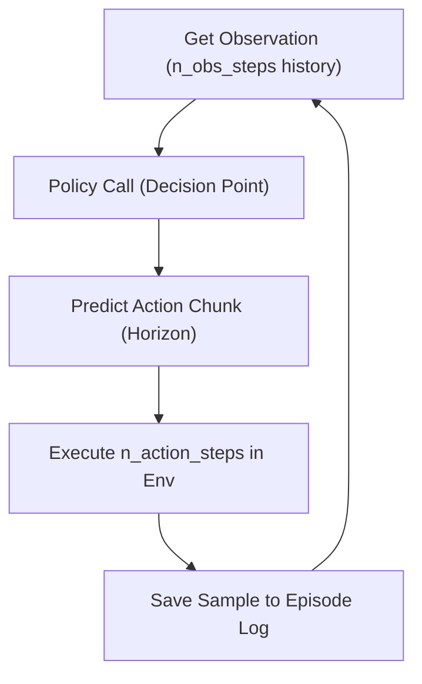

# Understanding Influence Matrices and Rollout Structure

This document clarifies the relationship between the influence matrix, policy decision points, and the environment execution steps in a rollout.

## Core Concepts

In the context of the **Action Influence Matrix**:
1.  **Samples**: The influence matrix shows how much each **training sample** (observation sequence → action chunk) influenced the policy's prediction for a specific **rollout sample**.
2.  **Decision Points**: Each "rollout sample" in the matrix represents a single **policy call**.
3.  **Action Chunking**: For each policy call, the model predicts a full "chunk" (horizon) of actions, but only executes a subset (`n_action_steps`).

## Rollout Structure

The process of a rollout follows this loop:

### 1. What does each frame in the Visualizer represent?
The "Rollout Samples" (often the y-axis in influence heatmaps or the timeline slider in the visualizer) correspond to **Decision Points** (Step B above). 
- If you move the slider by 1, you are moving to the **next policy call**.
- Between these two samples, the robot has executed `n_action_steps` (e.g., 8 steps).

### 2. What does each frame in the Rollout Video represent?
Standard rollout videos (the `.mp4` files) are usually recorded at a fixed FPS (e.g., 10 or 20 FPS).
- These videos record the **environment steps** (Step D above).
- Since multiple environment steps occur between policy calls, a typical video will show "fluid motion" between decision points.
- If `n_action_steps = 8`, there are 8 environment steps between frames shown in the visualizer's sample timeline.

### 3. Verification in Code
In `robomimic_image_runner.py`:
- `total_timesteps` (which maps to the influence matrix sample index) increments by **1** per policy call.
- `timestep` (the environment time) increments by `action.shape[1]` (the number of actions executed).

## Visualization vs. Execution

When you view an **Action Chunk** in the visualizer for a specific rollout sample (decision point):

- **What you see**: The plot shows the **entire predicted horizon** (e.g., 16 timesteps). This represents the policy's complete plan at that moment.
- **What was executed**: Only the first `n_action_steps` (e.g., 8) were actually carried out by the robot before the next decision was made.
- **Visual cue**: In the action plot, the actions from `0` to `n_action_steps - 1` are "realized" actions, while actions from `n_action_steps` to `horizon - 1` are "discarded" future plans that get replaced by the next policy call's prediction.

> [!TIP]
> This "overlap" is a core part of Diffusion Policy. Executing only a portion of the chunk and re-planning allows the policy to be reactive to environment changes while still maintaining a cohesive long-term plan.
